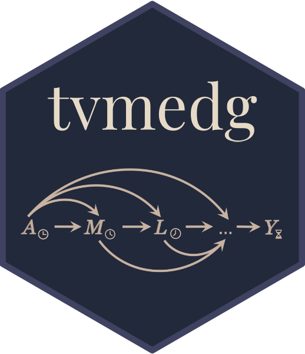

<!-- README.md is generated from README.Rmd. Please edit that file -->

```{r, include = FALSE}
knitr::opts_chunk$set(
  collapse = TRUE,
  comment = "#>",
  fig.path = "man/figures/README-",
  out.width = "100%"
)
```

# tvmedg 

<!-- badges: start -->
[](https://github.com/causalepi/tvmedg/actions/workflows/R-CMD-check.yaml)
[](https://app.codecov.io/gh/causalepi/tvmedg)
<!-- badges: end -->

The goal of tvmedg is to time-varying mediation analysis using g-computation

## Installation

You can install the development version of tvmedg like so:

``` r
# install.packages("devtools")
devtools::install_github("causalepi/tvmedg")
```

## Demo

```{r}
library(tvmedg)
library(ggplot2)
```

### Simulation data

```{r,echo=TRUE}
head(sim_data)
```

### Run model

```{r,echo=TRUE,warning=FALSE}
library(doParallel)

cl <- makeCluster(8)
registerDoParallel(cl)

op <- tvmedg(data = sim_data,
       basec = c("age","sex","ow","risk"),
       expo = c("Ap"),
       med = c("Mp"),
       tvar = c("L1","L2","L3"),
       outc = c("Yp"),
       time = c("mm"),
       lag = 2,
       norev = c("Mp"),
       cont_exp = F,
       cont_exp_std = F,
       tvar_to_med = F,
       mreg = "binomial",
       lreg = c("binomial","gaussian","gaussian"),
       yreg = "binomial",
       sp_list = c("mm"),
       sp_type = c("bs"),
       sp_df= c(3),
       followup = 12,
       seed = 123,
       montecarlo = 1000,
       boot = T, 
       nboot = 5,
       ci = .95,
       parallel=TRUE)

stopCluster(cl)
```

### Plot

```{r,echo=TRUE}
plot(op,"cumY")+
  scale_y_continuous(limits = c(0, 0.5)) +
  scale_x_continuous(breaks = seq(0, 12, by = 12))+
  labs(x = "Month",
       y = "%",
       caption = "The dashed line represents the observed %",
       color = NULL)+
  mytheme()
```

```{r,echo=TRUE}
plot(op,"tvY")+
  scale_y_continuous(limits = c(0, 0.5)) +
  scale_x_continuous(breaks = seq(0, 12, by = 12)) +
  labs(x = "Month",
       y = "%",
       caption = "The dashed line represents the observed %",
       color = NULL)+
  mytheme()
```
