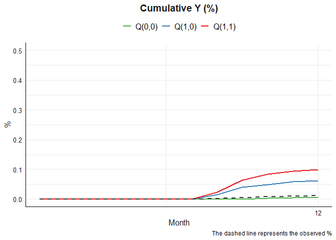
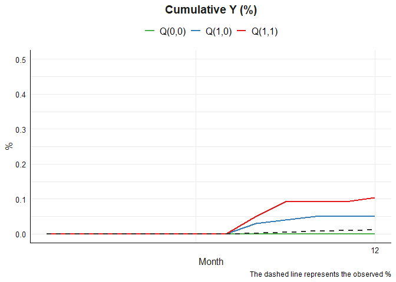

<!-- README.md is generated from README.Rmd. Please edit that file -->

# tvmedg 

<!-- badges: start -->

[](https://github.com/causalepi/tvmedg/actions/workflows/R-CMD-check.yaml)
[](https://app.codecov.io/gh/causalepi/tvmedg)
<!-- badges: end -->

The goal of tvmedg is to time-varying mediation analysis using
g-computation

## Installation

You can install the development version of tvmedg like so:

``` r
# install.packages("devtools")
devtools::install_github("causalepi/tvmedg")
```

## Demo

``` r
library(tvmedg)
library(ggplot2)
```

### Simulation data

``` r
head(sim_data)
#>   id mm Ap Mp L1       L2        L3 Yp      age sex ow risk lastid
#> 1  1  1  0  0  0 100.0000  80.00000  0 10.92764   1  1    0      0
#> 2  1  2  0  0  0 130.6644  88.06184  0 10.92764   1  1    0      0
#> 3  1  3  0  0  0 125.2740  97.63087  0 10.92764   1  1    0      0
#> 4  1  4  0  0  0 135.2596 112.20273  0 10.92764   1  1    0      0
#> 5  1  5  0  0  0 124.3786 108.05454  0 10.92764   1  1    0      0
#> 6  1  6  0  0  0 141.4882 123.36927  0 10.92764   1  1    0      0
```

### Run model

``` r
library(doParallel)
#> Loading required package: foreach
#> Loading required package: iterators
#> Loading required package: parallel

cl <- makeCluster(8)
registerDoParallel(cl)

op <- tvmedg(data = sim_data,
       basec = c("age","sex","ow","risk"),
       expo = c("Ap"),
       med = c("Mp"),
       tvar = c("L1","L2","L3"),
       outc = c("Yp"),
       time = c("mm"),
       lag = 2,
       norev = c("Mp"),
       cont_exp = F,
       cont_exp_std = F,
       tvar_to_med = F,
       mreg = "binomial",
       lreg = c("binomial","gaussian","gaussian"),
       yreg = "binomial",
       sp_list = c("mm"),
       sp_type = c("bs"),
       sp_df= c(3),
       followup = 12,
       seed = 123,
       montecarlo = 1000,
       boot = T, 
       nboot = 5,
       ci = .95,
       parallel=TRUE)
#> Q(a,a): 0.095 (0.083,0.32) 
#> Q(a,a*): 0.06 (0.005,0.183) 
#> Q(a*,a*): 0.004 (0,0.109) 
#> Indirect: 0.035 (-0.013,0.278) 
#> Direct: 0.056 (-0.007,0.172) 
#> Total: 0.091 (-0.012,0.32) 
#> Proportional explain: 0.385 (0.023,0.987) 
#> Total time elapsed: 17.54758 mins

stopCluster(cl)
```

### Plot

``` r
plot(op,"cumY")+
  scale_y_continuous(limits = c(0, 0.5)) +
  scale_x_continuous(breaks = seq(0, 12, by = 12))+
  labs(x = "Month",
       y = "%",
       caption = "The dashed line represents the observed %",
       color = NULL)+
  mytheme()
```



``` r
plot(op,"tvY")+
  scale_y_continuous(limits = c(0, 0.5)) +
  scale_x_continuous(breaks = seq(0, 12, by = 12)) +
  labs(x = "Month",
       y = "%",
       caption = "The dashed line represents the observed %",
       color = NULL)+
  mytheme()
```


