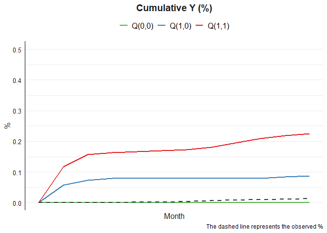

<!-- README.md is generated from README.Rmd. Please edit that file -->

# tvmedg 

<!-- badges: start -->

[](https://github.com/causalepi/tvmedg/actions/workflows/R-CMD-check.yaml)
[](https://app.codecov.io/gh/causalepi/tvmedg)
<!-- badges: end -->

The goal of tvmedg is to time-varying mediation analysis using
g-computation

## Installation

You can install the development version of tvmedg like so:

``` r
# install.packages("devtools")
devtools::install_github("causalepi/tvmedg")
```

## Demo

``` r
library(tvmedg)
```

### Simulation data

``` r
head(sim_data)
#>   id mm Ap Mp L1       L2        L3 Yp      age sex ow risk lastid
#> 1  1  1  0  0  0 100.0000  80.00000  0 10.92764   1  1    0      0
#> 2  1  2  0  0  0 130.6644  88.06184  0 10.92764   1  1    0      0
#> 3  1  3  0  0  0 125.2740  97.63087  0 10.92764   1  1    0      0
#> 4  1  4  0  0  0 135.2596 112.20273  0 10.92764   1  1    0      0
#> 5  1  5  0  0  0 124.3786 108.05454  0 10.92764   1  1    0      0
#> 6  1  6  0  0  0 141.4882 123.36927  0 10.92764   1  1    0      0
```

### Run model

``` r
library(doParallel)
#> Loading required package: foreach
#> Loading required package: iterators
#> Loading required package: parallel

cl <- makeCluster(8)
registerDoParallel(cl)

op <- tvmedg(data = sim_data,
             fix = c("age","sex","ow","risk"),
             expo = c("Ap"),
             med = c("Mp"),
             tvar = c("L1","L2","L3"),
             outc = c("Yp"),
             lag = 2,
             norev = c("Mp"),
             time = c("mm"),
             LM = F,
             boot = T,
             seed = 123,
             mreg = "binomial",
             lreg = c("binomial","gaussian","gaussian"),
             yreg = "binomial",dof = 3,
             montecarlo = 1000,length = 12,
             parallel=TRUE,nboot = 5,ci=.95)
#> Q(1,1): 0.098 (0.085,0.32) 
#> Q(1,0): 0.067 (0.005,0.18) 
#> Q(0,0): 0.004 (0,0.104) 
#> Indirect: 0.031 (-0.011,0.277) 
#> Direct: 0.063 (-0.001,0.169) 
#> Total: 0.094 (-0.004,0.319) 
#> Proportional explain: 0.33 (0.015,0.992) 
#> Total time elapsed: 1.112746 hours
```

### Plot

``` r
plot(op,"all")
```



``` r
plot(op,"cumY")
```


``` r
plot(op,"tvY")
```


