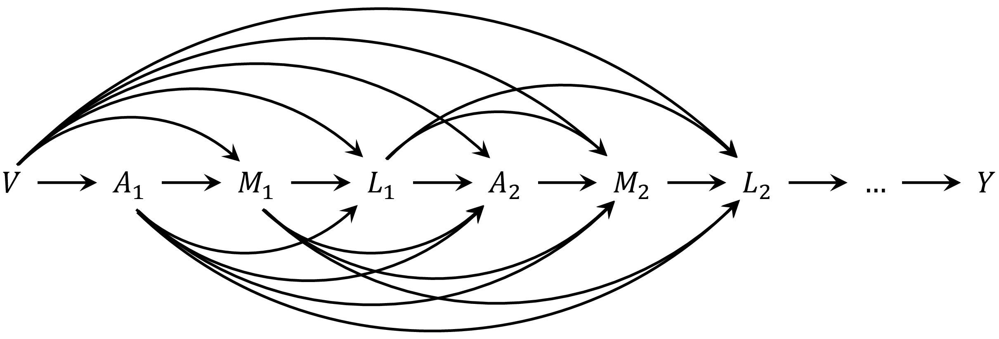

```{r, include = FALSE}
knitr::opts_chunk$set(
  collapse = TRUE,
  comment = "#>"
)
```


This example illustrates how to use `tvmedg()` function to conduct time-varying mediation analysis with binary exposure, single binary mediator, and binary outcome. We will use simulated **monthly** longitudinal data, where each row represents one month of follow-up per individual. The dataset includes the following variables: 

- Exposure: $Ap$

- Mediator: $Mp$

- Outcome: $Yp$

- Time-varying confounders: $L_1$ binary, $L_2$ and $L_3$ continuous

- Time-fixed confounders: `age`, `sex`, `ow`, and `risk`

- Time index: `mm`, indicating the month of follow-up


Since, g-computation is computationally intensive, we will leverage parallel computing using the `foreach` and `doParallel` packages to improve efficiency


```{r}
library(tvmedg)
library(doParallel)
head(sim_data)
```


### Point estimates

First example is when the **mediator precedes the time-varying confounders** ($M \rightarrow L$). This corresponds to the following DAG


```{r dag_amly, fig.align="center", echo=FALSE, out.width='75%'}

```


To specify the causal ordering $M \rightarrow L$, set the argument `tvar_to_med = FALSE` (the default). In contrast, if the time-varying confounder is assumed to precede the mediator ($L \rightarrow M$), use `tvar_to_med = TRUE`.

The current version of `tvmedg` supports **lag-based functional forms** for variable histories. In this example, we specify 2 lags. By default, logistic regression is used for binary variables, and linear regression is used for continuous variables. For continuous variables and time indices, **spline-based models** can be used by specifying: `sp_list`, `sp_type`, and `sp_df`. This example sets a cubic spline with 3 degrees of freedom for the month variable `mm`. Additional variables, spline types (e.g., "ns"), and df can be added to these arguments to  model nonlinear effects. Lastly, we run the algorithm using 1000 Monte Carlo samples.


```{r, warning=FALSE, eval=FALSE}
cl <- makeCluster(8)
registerDoParallel(cl)
med_MtoL <- tvmedg(data = sim_data,
                   basec = c("age","sex","ow","risk"),
                   expo = c("Ap"),
                   med = c("Mp"),
                   tvar = c("L1","L2","L3"),
                   outc = c("Yp"),
                   time = c("mm"),
                   lag = 2,
                   tvar_to_med = F,
                   cont_exp = F,
                   mreg = "binomial",
                   lreg = c("binomial","gaussian","gaussian"),
                   yreg = "binomial",
                   sp_list = c("mm"),
                   sp_type = c("bs"),
                   sp_df = c(3),
                   followup = 12,
                   seed = 123,
                   montecarlo = 1000,
                   boot = F,
                   parallel = TRUE)
stopCluster(cl)
```


### Confidence interval

`tvmedg` implements **non-parametric bootstrap** to obtain confidence intervals for effect estimates. This can be enabled by setting `boot = TRUE`, along with specifying the number of bootstrap samples via `nboot`, and the desired confidence level `ci` (e.g., `ci = 0.95`).

For illustration purposes, and to reduce computational burden in this example, we run only 5 bootstrap iterations.


```{r, warning=FALSE, eval=FALSE}
med_MtoL_ci <- tvmedg(data = sim_data,
                   basec = c("age","sex","ow","risk"),
                   expo = c("Ap"),
                   med = c("Mp"),
                   tvar = c("L1","L2","L3"),
                   outc = c("Yp"),
                   time = c("mm"),
                   lag = 2,
                   tvar_to_med = F,
                   cont_exp = F,
                   mreg = "binomial",
                   lreg = c("binomial","gaussian","gaussian"),
                   yreg = "binomial",
                   sp_list = c("mm"),
                   sp_type = c("bs"),
                   sp_df = c(3),
                   followup = 12,
                   seed = 123,
                   montecarlo = 1000,
                   boot = T,
                   nboot = 5,
                   ci = .95,
                   parallel = TRUE)
stopCluster(cl)
```


### Validation


Diagnostic tools for checking the g-computation algorithm are limited. However, we should expect the **observed outcome trajectory** to lie between the predicted values of $Q(a, a)$, $Q(a, a^*)$, and $Q(a^*, a^*)$ over time.

To aid in this evaluation, `tvmedg` provides two diagnostic plots:

1. A plot comparing the **observed outcome** with the **simulated outcomes** under the three exposure–mediator scenarios across time.

2. A plot of the **cumulative outcomes** over time under each scenario.


**Time-varying plot**

```{r, eval=FALSE}
plot(med_MtoL, "tvY")
```


**Cumulative plot**

```{r, eval=FALSE}
plot(med_MtoL, "cumY")
```


