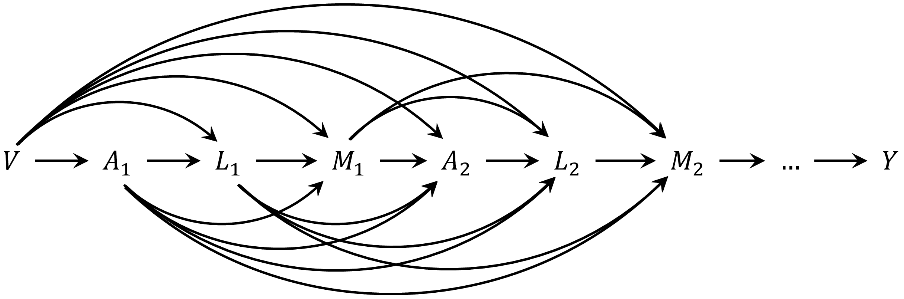
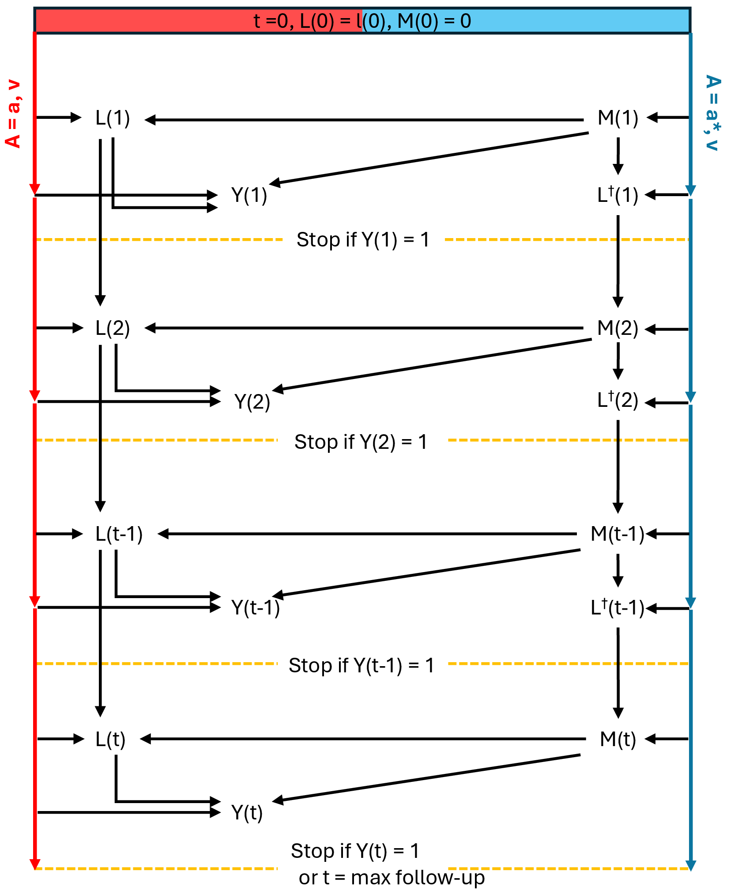

```{r, include = FALSE}
knitr::opts_chunk$set(
  collapse = TRUE,
  comment = "#>"
)
```

## Background

Notations

-   Let $A$ denote the exposure of interest, taking values $a$ and $a^\ast$. Let $Y$ be the outcome, $M$ the mediator, $L$ the time-varying confounder, and $v$ the vector of pre-exposure (time-fixed) covariates.

-   Let $Y_a$ and $M_a$ denote the values of the outcome and mediator, respectively, that would have been observed had the exposure $A$ been set to $a$; similarly, $Y_{a^\ast}$ and $M_{a^\ast}$ represent the potential values under $A = a^\ast$.

The average total effect can be then decomposed into natural direct and indirect effects as:

$$
E(Y_a - Y_{a^*}) = E(Y_{aM_{a}} - Y_{a^*M_{a^*}}) =  \underbrace{E(Y_{aM_{a}} - Y_{aM_{a^*}})}_{\text{Natural indirect effect}} + \underbrace{E(Y_{aM_{a^*}} - Y_{a^*M_{a^*}})}_{\text{Natural direct effect}}
$$

The potential outcomes $Y_{aM_a}$ and $Y_{a^\ast M_{a^\ast}}$ represent the values of the outcome under exposure levels $a$ and $a^\ast$, respectively, with the mediator taking its natural value under each exposure. In contrast, $Y_{aM_{a^\ast}}$ describes the outcome under exposure $a$, but with the mediator set to the value it would have taken under $a^\ast$, capturing a cross-world scenario relevant to mediation analysis.

In the context of mediator–outcome confounders being affected by the exposure (i.e., $Y_{am} \not\!\perp\!\!\!\perp M_{a^*}|V$ - violation of identification condition), the natural direct and indirect effect above are not identified. The randomized interventional analogues were introduced.

Let $G_{a|v}$ denote the a random draw from the distribution of the mediator with exposure $A$ is set at $a$ conditional on covariates $v$. In other words, $G$ reflects a stochastic draw from its conditional distribution rather than a fixed potential value of the mediator. The randomized interventional analogues of natural direct and indirect effects are defined as

$$
E(Y_{aG_{a} \mid v}) - E(Y_{a^*G_{a^*} \mid v}) 
= E(Y_{aG_{a} \mid v}) - E(Y_{aG_{a^*} \mid v}) 
+  E(Y_{aG_{a^*} \mid v}) - E(Y_{a^*G_{a^*} \mid v}) 
$$

In the longitudinal setting, the overbars denote the history of variables up to time $t$. The total effect of a longitudinal exposure regime $\bar{a}$ versus $\bar{a}^*$ can be decomposed as:

$$
E(Y_{\bar{a} \bar{G}_{\bar{a} \mid v}} \mid v) - E(Y_{\bar{a}^* \bar{G}_{\bar{a}^* \mid v}} \mid v)
=  
\underbrace{E(Y_{\bar{a} \bar{G}_{\bar{a} \mid v}} \mid v) - E(Y_{\bar{a} \bar{G}_{\bar{a}^* \mid v}} \mid v)}_{\text{interventional indirect effect}}
+ 
\underbrace{E(Y_{\bar{a} \bar{G}_{\bar{a}^* \mid v}} \mid v) - E(Y_{\bar{a}^* \bar{G}_{\bar{a}^* \mid v}} \mid v)}_{\text{interventional direct effect}}.
$$

As shown by [VanderWeele and Tchetgen Tchetgen (2017)](https://academic.oup.com/jrsssb/article/79/3/917/7040673), the interventional analogues of natural direct and indirect effects, under the causal DAG (below) where the mediator precedes the time-varying confounder ($M$ preceding $L$), can be identified using the so-called *mediational g-formula*.

```{r dag_amly_a, fig.align="center", echo=FALSE, out.width='80%', fig.cap = "DAG for the context that the mediator precedes the time-varying confounder"}
knitr::include_graphics("../man/figures/amly.png")
```

In particular, the identification of $E(Y_{\bar{a} \bar{G}_{\bar{a}^*}\mid v} \mid v)$ is

\begin{align*}
E(Y_{\bar{a} \bar{G}_{\bar{a}^*}\mid v} \mid v) =
&\int_{\bar{m}} \int_{\bar{l}(T-1)}
E(Y \mid \bar{a}, \bar{m}, \bar{l}, v)
\prod_{t=1}^{T-1} dP\left( \bar{l}(t) \mid \bar{a}(t), \bar{m}(t), \bar{l}(t-1), v \right) \\
&\times
\left[
\int_{\bar{l}^\dagger(T-1)}
\prod_{t=1}^{T}
P\left( m(t) \mid \bar{a}^*(t), \bar{m}(t-1), \bar{l}^\dagger(t-1), v \right)
\, dP\left( \bar{l}^\dagger(t-1) \mid \bar{a}^*(t-1), \bar{m}(t-1), \bar{l}^\dagger(t-2), v \right)
\right]
\end{align*}

In the context where time-varying confounder precedes the mediator ($L$ preceding $M$)

```{r dag_almy_a, fig.align="center", echo=FALSE, out.width='80%', fig.cap = "DAG for the context that the time-varying confounder precedes the mediator"}

```

The *mediational g-formula* identification for $E(Y_{\bar{a} \bar{G}_{\bar{a}^*}\mid v} \mid v)$ becomes

\begin{align*}
E(Y_{\bar{a} \bar{G}_{\bar{a}^*}\mid v} \mid v) =
&\int_{\bar{m}} \int_{\bar{l}(T-1)}
E(Y \mid \bar{a}, \bar{m}, \bar{l}, v)
\prod_{t=1}^{T-1} dP\left( \bar{l}(t) \mid \bar{a}(t), \bar{m}(t-1), \bar{l}(t-1), v \right) \\
&\times d\left[
\int_{\bar{l}^\dagger(T-1)}
\prod_{t=1}^{T}
P\left( m(t) \mid \bar{a}^*(t), \bar{m}(t-1), \bar{l}^\dagger(t), v \right)
\, dP\left( \bar{l}^\dagger(t) \mid \bar{a}^*(t), \bar{m}(t-1), \bar{l}^\dagger(t-1), v \right)
\right].
\end{align*}

For ease of notation, let’s adopt the same shorthand notations as in the VanderWeele and Tchetgen Tchetgen (2017) paper: $Q(a, a)$ to represent $E(Y_{\bar{a} \bar{G}_{\bar{a}}\mid v} \mid v)$, $Q(a, a^*)$ for $E(Y_{\bar{a} \bar{G}_{\bar{a}^*}\mid v} \mid v)$, and $Q(a^*, a^*)$ for $E(Y_{\bar{a}^* \bar{G}_{\bar{a}^*}\mid v} \mid v)$,

## G-computation Algorithms in tvmedg

tvmedg implements g-computation to estimate interventional direct and indirect effects in longitudinal settings, based on the *mediational g-formula* mentioned above. The core algorithm involves 4 main steps:

- **Step 1: Fitting parametric models**

  `tvmedg()` fits the user-specified regression models for each time-varying variable, conditional on relevant history and baseline covariates:

  - Time-varying confounders:  
    - \( E(\bar{L}(t) \mid \bar{a}(t), \bar{m}(t), \bar{l}(t-1), v) \) if (\( M \) preceding \( L \))  
    - \( E(\bar{L}(t) \mid \bar{a}(t), \bar{m}(t-1), \bar{l}(t-1), v) \) if (\( L \) preceding \( M \))

  - Mediator:  
    - \( E(M(t) \mid \bar{a}^*(t), \bar{m}(t-1), \bar{l}^\dagger(t-1), v) \)

  - Outcome:  
    - \( E(Y \mid \bar{a}, \bar{m}, \bar{l}, v) \)


- **Step 2: Monte Carlo sampling**  
  Resample the values of all variables at baseline, including time-fixed covariates $V$ and time-varying confounders $L$ at time $t = 0$. This step approximates the baseline covariate distribution and improves the stability and precision of predictions in Step 3.


- **Step 3: Predict follow-up**  
  Using the baseline samples generated in Step 2, Step 3 simulates follow-up trajectories by sequentially predicting time-varying confounders, mediators, and outcomes under specified exposure regimes. This process is illustrated in the following figure (as an example for estimating $Q(a, a^*)$) in the context of binary outcome.

```{r algo_step, fig.align="center", echo=FALSE, out.width='60%', fig.cap = "g-computation in tvmedg"}

```


- **Step 4: Estimating interventional analogues of natural direct and indirect effects**  
  Estimating $Q(a, a)$, $Q(a, a^*)$, and $Q(a^*, a^*)$ at the end of follow-up and derive:

  - Interventional total effect (rTE):  $Q(a, a) - Q(a^*, a^*)$

  - Interventional direct effect (rDE):  $Q(a, a^*) - Q(a^*, a^*)$

  - Interventional indirect effect:  $Q(a, a) - Q(a, a^*)$
  
  - Proportional explain: Indirect effect / Total effect


## References

VanderWeele, T. (2015). Explanation in causal inference: methods for mediation and interaction. Oxford University Press.

VanderWeele, T. J., & Tchetgen Tchetgen, E. J. (2017). Mediation analysis with time varying exposures and mediators. Journal of the Royal Statistical Society Series B: Statistical Methodology, 79(3), 917-938.


   
   
   
